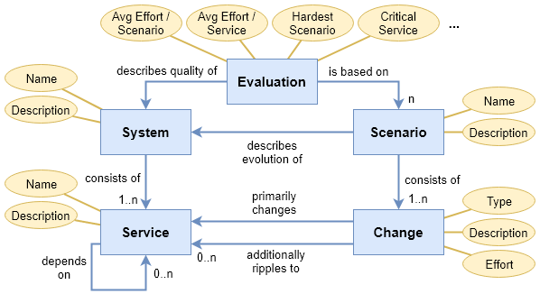

# Scenario-Based Evolvability Evaluation of Service- and Microservice-Based Systems

> A tool to support the scenario-based evolvability evaluation of service- and microservice-based systems

**CI Status:**

**SonarQube Status for API Component:**

**SonarQube Status for Frontend Component:**

For more information on the scenario-based method and its evaluation, see the [\_docs](_docs) folder. To illustrate the method, an example system with scenarios is also part of the tool. The tool consists of three main components, namely a RESTful API implemented with Node.js (see `api` folder), a MongoDB for data persistence, and a web-based frontend for end-user access implemented with Vue.js (see `frontend` folder).

## Quick Start Guide

-   Download and install [Node.js](https://nodejs.org/en/download)
-   Download and install [MongoDB](https://www.mongodb.com/download-center/community), then start it on port 27017
-   Start the API
    -   Navigate into the `api` directory and install dependencies via `npm install`
    -   Start the API via `npm start`
-   Start the web frontend
    -   Navigate into the `frontend` directory and install dependencies via `npm install`
    -   Start the frontend via `npm start`
-   API will be available at <http://localhost:3000>
-   Swagger UI will be available at <http://localhost:3000/api-docs>
-   Your browser will open the frontend at <http://localhost:8000> and you can start using the application

## Docker Quick Start Guide

For more details, please refer to our [Docker README](docker/README.md).

-   Download and install [Docker](https://www.docker.com/get-started)
-   Download the `docker/docker-compose.yml` file from our repository
-   In the directory containing the downloaded file, execute `docker-compose up`
-   API will be available at <http://localhost:3000>
-   Swagger UI will be available at <http://localhost:3000/api-docs>
-   Frontend will be available at <http://localhost:8000>
