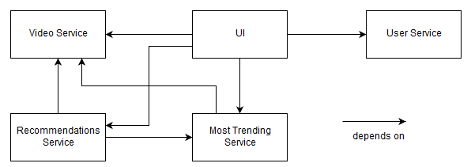

# Interview Task Descriptions and Questions

> Topic: Evolution of a Video Platform

This document contains the interview task descriptions as well as questions asked by the interviewer.

## System Description

Imagine a system where a user can watch videos and also upload his own videos. The system calculates the most popular videos and shows them in a tab in the UI. A user can browse through all videos in the UI. While watching a video, the system gives recommendations what other videos the user might want to watch based on the currently watched video and recent trends.

| Service                 | Description                                                                     | Dependencies                                                                |
| ----------------------- | ------------------------------------------------------------------------------- | --------------------------------------------------------------------------- |
| User Service            | Through this service, users can log in and manage their data.                   | -                                                                           |
| Video Service           | Is responsible for video uploading and showing videos to the user.              | -                                                                           |
| Most Trending Service   | Calculates the most trending videos based on recently watched and liked videos. | Video Service                                                               |
| Recommendations Service | Presents recommended videos based on likes and trends.                          | Most Trending Service, Video Service                                        |
| UI                      | Takes care of everything the user sees.                                         | Most Trending Service, Recommendations Service, User Service, Video Service |

**Task:** Create this system and its services in the tool.

## Scenario Descriptions

Market changes, security concerns, and new technology may require changes to your video platform in the future. Therefore, you collected the following hypothetical evolution scenarios and thought about their potential impact on the system.

- To improve performance, the database management system in the Video Service should be exchanged.
- The system should be extended with instant messaging functionality. For that, a new service called Instant Messaging Service must be created.
- The complex Most Trending Service has become fairly large and unmaintainable. To increase its analyzability, the service should be rewritten in Python using a very convenient library.
- Due to security concerns and regulations, two-step verification should be implemented. This requires additional attributes in the user service and also affects the UI.

**Task:** Create these scenarios and their corresponding change(s) in the tool.

## Scenario Evaluation

After finishing scenario creation, go to the evaluation tab in the tool, select the created system. Then try to answer the following questions.

- Which service is changed the most?
- Which service is associated with the highest scenario effort?
- Which is the total potential scenario effort for the system?
- Which scenario is associated with the highest effort?
- Which scenario changes most services?

## Retrospective Questions

**Performed tasks:**
- How complex was it to create the system? (1: not complex, 5: very complex)
- [What exactly was complex about creating the system?]
- How complex was it to define dependencies between services? (1: not complex, 5: very complex)
- [What exactly was complex about defining dependencies between services?]
- Do you find it useful to have categories for scenarios? (1: not useful, 5: very useful)
- How complex was it to create a scenario? (1: not complex, 5: very complex)
- [What exactly was complex about creating a scenario?]

**Evaluation view:**
- Do you find the recommended ripples helpful? (1: not helpful, 5: very helpful)
- Do you find the evaluation useful? (1: not useful, 5: very useful)
- Which evaluation attributes do you find useful, which unnecessary?

**Demographics:**
- How many years of professional experience do you have?
- Have you used a scenario-based method for a real-world project before?
- How familiar are you with scenario-based methods in general? (1: not familiar, 5: very familiar)
- How familiar are you with service- or microservice-based systems in general? (1: not familiar, 5: very familiar)

