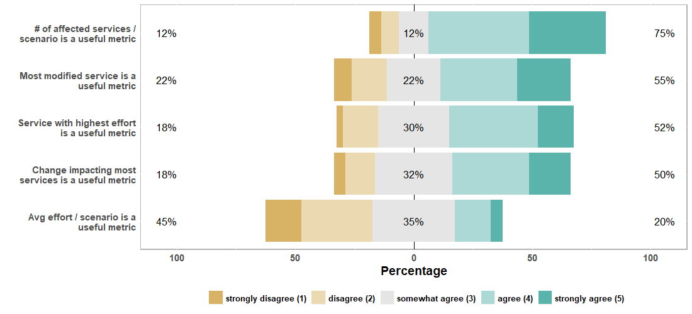

# Web-Based Survey

This directory contains all data and artifacts related to the survey.

-   [Questions](survey-questions.md)
-   [Data](survey-data.csv) as CSV
-   [Analysis procedure](survey-analysis-script.R) as an R script

## Aggregated Results

**Effort Estimation Techniques: Familiarity**

**Effort Estimation Techniques: Precision**

**Effort Estimation Techniques: Applicability**

**Evaluation Metrics: Usefulness**

