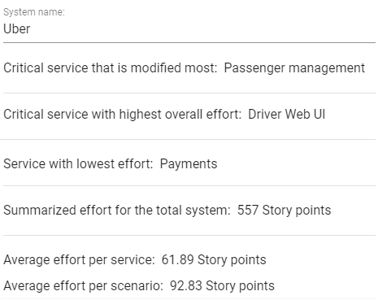
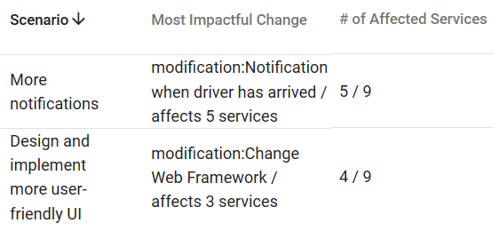

# Survey Questions

This document contains all 17 survey questions for documentation purposes. The survey was hosted on Google Forms from 15.04.2019 to 12.05.2019.

## Preamble

To analyze how well a service-based system would adjust to changes in the future, we are working on a lightweight scenario-based evaluation method specifically designed for service orientation. We also develop tool support for this method and want to align it with software professionals' needs.

Within the scope of such a method, we'd like to hear about:
- your opinion on different ways to estimate the scenario effort (6 questions)
- your opinion on different metrics supporting the modifiability analysis of a system (6 questions)
- your personal experience with these topics (5 questions)

In total, there are 17 questions which should take approximately 5-7 minutes. Results are collected anonymously. Should you have any questions or should you be interested in the results, please contact justus.bogner@reutlingen-university.de. Feel free to distribute to your colleagues.

Thank you for your participation!

## Change Effort Estimation

In our tool, you can create "Scenarios". Each "Scenario" consists of at least one "Change". For estimating the effort of these "Changes", different techniques can be used.

For each variant, we'd like to hear your experience concerning
- how familiar you are with this technique (Familiarity)
- how precise this technique is (Precision)
- how applicable  this technique is for effort estimation in a lightweight scenario-based method for service-based systems (Applicability)

On the scale from 1 to 5, 1 represents "not precise", "not familiar" and "not applicable" while 5 represents "very precise", "very familiar" and "very applicable".

### Effort in "Hours of development"

A common way to estimate effort is by using development hours, i.e. the duration it takes to implement the "Change".

- Familiarity (1 to 5):
- Precision (1 to 5):
- Applicability (1 to 5):

### Effort as "Lines of Code"

Another common technique to estimate the needed effort for a "Change" is lines of code (LOC).

- Familiarity (1 to 5):
- Precision (1 to 5):
- Applicability (1 to 5):

### Effort as an "Ordinal Scale"

With an ordinal scale from 1 to 10, the effort and complexity of a "Change" can be described, where 1 is easy and not time-consuming and 10 very difficult and very time-consuming.

- Familiarity (1 to 5):
- Precision (1 to 5):
- Applicability (1 to 5):

### Effort as "Cosmic Function Points"

The COSMIC method defines principles, rules, and a process for measuring the functional size of software. "Functional size" is a measure for the amount of provided functionality and completely independent of the implementation.
More details about the technique can be found [here](https://cosmic-sizing.org/cosmic-fsm).

- Familiarity (1 to 5):
- Precision (1 to 5):
- Applicability (1 to 5):

### Effort as "Story Points"

The size of a story is determined by its complexity. The complexity can e.g. depend on how often architectural layers are crossed. The story points are often determined by an adjusted Fibonacci sequence, e.g. 1, 2, 3, 5, 8, 13, 20, 40, 100. More details can be found [here](https://www.mountaingoatsoftware.com/blog/what-are-story-points).

- Familiarity (1 to 5):
- Precision (1 to 5):
- Applicability (1 to 5):

### What other effort estimation techniques would you consider useful in a lightweight scenario-based method?

## Evaluation Attributes - Part 1

The following picture is a screenshot from the evaluation view of our tool. Several metrics and attributes about the entered system and "Scenarios" are displayed. We'd like to hear your opinion about the usefulness of these information in the context of modifiability analysis. For the following questions, 1 represents "not useful" while 5 represents "very useful".

### How useful is information about the critical service that is most modified (1 to 5)?

### How useful is information about the critical service with the highest effort (1 to 5)?

### How useful is the average effort per "Scenario" (1 to 5)?

## Evaluation Attributes - Part 2

The following picture is a 2nd screenshot from the evaluation view of our tool. A table of all "Scenarios" with some metrics is displayed. "Scenarios" consist of at least one "Change". We'd like to hear your opinion about the usefulness of the following information in the context of modifiability analysis. For the following questions, 1 represents "not useful" while 5 represents "very useful".

### How useful is information about the "Change" that impacts the most services (1 to 5)?

### How useful is the number of affected services for each "Scenario" (1 to 5)?

### What other evaluation attributes would you consider useful in a lightweight scenario-based method?

## Professional Experience

In this section, we like to ask some general professional details about you. For the following questions, 1 represents "not familiar" while 5 represents "very familiar".

### In which field(s) are you currently active?

- Industry
- Academia
- Both

### How many years of professional experience do you have?

### Have you used a scenario-based method for a real-world project before?

- Yes
- No

### How familiar are you with scenario-based methods in general (1 to 5)?

### How familiar are you with service- or microservice-based systems in general (1 to 5)?

## Outro

Thank you for your time! Should you have any questions or should you be interested in the results, please contact justus.bogner@reutlingen-university.de. Feel free to distribute to your colleagues.