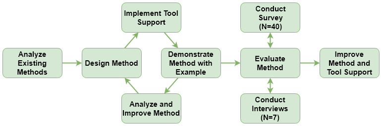

# Details of the Scenario-Based Method

The goal of our method is to provide qualitative scenario-based evolvability evaluation for service- and microservice-based systems with reasonable manual effort. By focusing on limited system types and one quality attribute, we can rely on a more precise terminology and change categorization. Furthermore, we can assume a decent degree of service independence as well as a clean separation of service interface and implementation. Changes that do not modify a service interface usually do not propagate to service consumers. Lastly, we also tried to keep the method lightweight by focusing on simplicity and tool support. To illustrate the method, an example system with scenarios is also part of the tool.

## Research Design

To create the method, we first analyzed existing scenario-based methods like SAAM, ATAM, and ALMA, but also specifically searched for lightweight or service-based approaches. Based on these results, we designed our own method in an iterative way. A design candidate for the method was implemented in a web-based tool and demonstrated by applying it to an example system. Method and tool were then analyzed for possible improvements, which were incorporated into the method. This started the next iteration. Once a mature state for method and tool was reached, we evaluated this version with an online survey as well as hands-on interviews. These evaluation results were then used to improve method and tool for a second time.

## Conceptual Model

The method is based on a meta model with five different entities. The analysis target is a _System_ that consists of at least one _Service_. Optionally, dependencies between _Services_ can be modeled. The potential evolution of the _System_ (e.g. a service-based web shop) is described by coarse-grained _Scenarios_ (e.g. the addition of a new payment method). A _Scenario_ consists of at least one _Change_. A _Change_ always targets a single _Service_ and may be of different _Types_, namely _addition_ (adding a new service), _modification_ (changing an existing service), or _deletion_ (removing an existing service). Additionally, a _Change_ may also ripple to other _Services_, especially if it modifies a service interface. Previously specified service dependencies are used to suggest potential ripple effects. _Changes_ also have associated _Effort_ as a measure for their implementation duration or complexity. Currently, we support the estimation techniques _hours_, _ordinal scale_ (1 to 10, with 10 being most time consuming / complex), _COSMIC function points_, and _story points_. Based on the created _Scenarios_, an evolvability _Evaluation_ for the _System_ is synthesized. _Effort_ is aggregated to the _Scenario_ level and then used for various system evaluation metrics like the _Average Effort per Scenario_, the _Average Effort per Service_, or the _Most Critical Service_. In general, information and metrics provided through an _Evaluation_ should support an estimation of the system's evolution qualities and the identification of weak spots in the architecture.

## Process

The model presented above is the foundation for the four different process steps of the method. They are designed to also produce reasonable results with only very few users, but the quality of the results will increase if various stakeholders with technical as well as business background are involved. Work within the different steps can also be distributed and performed independently with a later synchronization meeting.

1. **Describe the system architecture** a list of _Services_ with a short description and (optionally) dependencies between them is created. This step has to be performed by technical stakeholders like developers or architects. If the _System_ is very large, a subset can be modeled instead, e.g. a domain.
2. **Elicit evolution scenarios** possible future evolution _Scenarios_ are collected and documented. Fitting candidates are cases fairly likely to happen or cases intuitively posing high risk for the _System_. For a broad range of _Scenarios_, business and domain experts should be included in this step.
3. **Specify and estimate changes for each scenario** the details and impact of the identified _Scenarios_ are now worked out by documenting the concrete _Changes_. This step again requires technical stakeholders.
    - **Specify and estimate initial changes** the initial set of _Changes_ (one per affected _Service_) is defined and the _Effort_ for each _Change_ is estimated. Stakeholders should agree on a single estimation technique, e.g. _hours_. If work in this step is distributed, stakeholders should first calibrate their estimation with some example _Changes_.
    - **Identify ripple effects** for each _Change_, potential ripple effects to other _Services_ are identified and documented as new _Changes_. Service interface _Changes_ are especially important for this step.
4. **Evaluate results** created _Scenarios_ are analyzed, estimated _Effort_ is aggregated, and _Evaluation_ metrics are calculated. Based on this, _System_ evolvability is interpreted, weak spots are identified, and architecture improvements are derived. This step should be a synchronized group activity.
